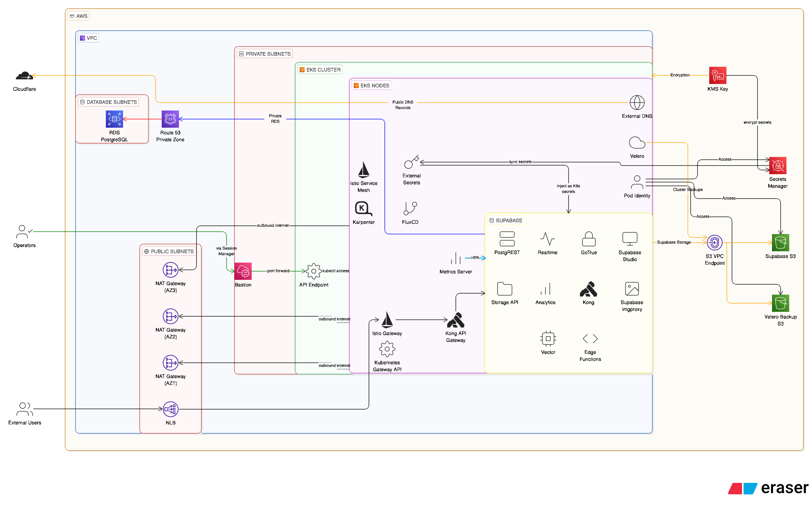

# Supabase on AWS EKS with FluxCD GitOps

Production ready, self-hosted Supabase deployment on AWS using Kubernetes (EKS), managed through FluxCD GitOps workflows. This repository contains all Kubernetes manifests, Helm charts, and configurations for deploying a complete, secure, and scalable Supabase platform.

## Table of Contents

- [Architecture Overview](#architecture-overview)
- [Technology Choices](#technology-choices)
- [Prerequisites](#prerequisites)
- [Repository Structure](#repository-structure)
- [Deployment Instructions](#deployment-instructions)
- [Verification & Testing](#verification--testing)
- [Autoscaling](#autoscaling)
- [Security & Scalability Deep Dive](#security--scalability-deep-dive)
- [Observability](#observability)
- [Tear-down Instructions](#tear-down-instructions)

## Architecture Overview

### High-Level Architecture




### Component Interaction Flow

1. **GitOps Workflow**: FluxCD monitors this Git repository, automatically applying changes to the cluster
2. **Traffic Flow**: External requests → Istio Gateway (Kubernetes Gateway API) → Kong → Supabase microservices
3. **Service Mesh**: All pod-to-pod communication encrypted via Istio ambient mTLS (no sidecars)
4. **Secrets**: External Secrets Operator syncs secrets from AWS Secrets Manager into Kubernetes Secrets
5. **DNS**: External DNS automatically creates/updates Route53 records in Cloudflare based on Kubernetes resources
6. **Autoscaling**: HPA scales pods based on CPU/memory, Karpenter for quick and efficient node provisioning
7. **Backup**: Velero automatically backs up cluster resources and persistent volumes to S3 every 15 minutes

## Technology Choices

### Infrastructure (Terraform)

**Why Terraform?**

- Industry-standard IaC tool with mature AWS provider
- Declarative syntax enables predictable infrastructure changes
- Strong community support and extensive module ecosystem
- State management with S3 backend ensures team collaboration
- Native support for all AWS services required (EKS, RDS, Secrets Manager, etc.)

**Why not CDKTF or Pulumi?** While CDKTF/Pulumi offers programming language benefits, the added complexity and smaller community weren't justified for this deployment (and because CDKTF is deprecated). Standard Terraform HCL provides sufficient expressiveness with better debugging and community resources.

### GitOps (FluxCD)

**Why FluxCD over ArgoCD?**

- **Lightweight**: Flux has a smaller footprint and lower resource consumption
- **Kubernetes-native**: Uses Kustomize natively without additional abstractions, works with Helm natively
- **Multi-tenancy**: Better namespace isolation for multi-environment setups
- **Terraform integration**: Easier bootstrap via Terraform flux provider
- **Dependency management**: Native support for Kustomization dependencies

### Service Mesh (Istio Ambient Mode)

**Why Istio Ambient Mode?**

- **Zero-trust networking**: Automatic mTLS encryption for all service-to-service communication
- **No sidecars**: Ambient mode eliminates sidecar proxy overhead (memory, latency, complexity)
- **Observability**: Built-in traffic telemetry without application instrumentation
- **Progressive security**: Can selectively enforce policies per namespace

**Why not other service meshes?**

- Linkerd: Excellent choice but less mature ambient/sidecar-less support
- Consul: Better for multi-cloud but unnecessary complexity for single cloud
- Plain Kubernetes NetworkPolicies: Insufficient for zero-trust and observability

### Ingress (Kubernetes Gateway API)

**Why Kubernetes Gateway API over NGINX Ingress?**

- **CNCF standard**: Gateway API is the future of Kubernetes ingress, officially part of the Kubernetes project
- **NGINX deprecation**: NGINX Ingress Controller is being deprecated in favor of Gateway API
- **Role-oriented**: Clear separation between infrastructure providers and application developers
- **Expressive routing**: Native support for header-based routing, traffic splitting, and advanced L7 features
- **Multi-tenancy**: Better isolation with Gateway/HTTPRoute resource model
- **Service mesh integration**: Native integration with Istio for unified traffic management

**Why not alternatives?**

- NGINX Ingress: Deprecated, less flexible routing capabilities, monolithic configuration
- AWS ALB Controller: Cloud-specific, less portable, higher latency for internal traffic
- Traefik: Good alternative but Gateway API provides better standardization and future-proofing

### DNS Management (External DNS)

**Why External DNS?**

- **Automation**: Automatically creates and updates DNS records based on Kubernetes resources (Services, HTTPRoutes, Ingress)
- **GitOps-friendly**: DNS management becomes declarative and version-controlled alongside application manifests
- **Multi-provider support**: Works with Route53, Cloudflare, and 30+ DNS providers
- **HTTPRoute integration**: Native support for Gateway API HTTPRoutes - automatically updates DNS when routes change
- **Reduced manual work**: Eliminates manual DNS record management in cloud provider consoles

**Implementation**: External DNS watches HTTPRoutes and Services, automatically creating DNS records in the configured provider (Cloudflare in this setup). When a new HTTPRoute is created with a hostname, External DNS creates the corresponding DNS record pointing to the Istio Gateway load balancer.

### Metrics (Metrics Server)

**Why Metrics Server?**

- **HPA dependency**: Required for Horizontal Pod Autoscaler (HPA) to function - provides CPU/memory metrics
- **Lightweight**: Minimal resource footprint compared to full Prometheus deployment
- **Real-time metrics**: Provides current resource utilization for kubectl top and autoscaling decisions
- **Kubernetes-native**: Official Kubernetes SIG project, standard across all clusters
- **Fast scraping**: Metrics available within 15-30 seconds for quick autoscaling responses

**Use case**: Metrics Server enables HPA to scale Supabase services (Auth, PostgREST, Realtime, Storage) based on CPU and memory utilization. Without Metrics Server, HPA cannot retrieve resource metrics and autoscaling will not function.

### Autoscaling (Karpenter)

**Why Karpenter over Cluster Autoscaler?**

- **Faster scaling**: Provisions nodes faster (30-60s vs 2-5 minutes)
- **Bin-packing efficiency**: Better utilization through intelligent instance selection
- **Spot instance support**: Seamless mixed on-demand/spot strategies
- **Disruption handling**: Automatic node consolidation and upgrades
- **Pod-level scheduling**: Directly watches pod scheduling events, no intermediate abstractions

### Secrets Management (External Secrets Operator)

**Why External Secrets Operator?**

- **Cloud-native integration**: First-class AWS Secrets Manager support
- **Security**: Secrets never stored in Git, only references
- **Synchronization**: Automatic secret rotation when source changes
- **Multi-backend**: Can integrate with Vault, Parameter Store, or other backends if needed

**Why not alternatives?**

- Sealed Secrets: Requires managing encryption keys, less secure
- Kubernetes Secrets in Git: Security anti-pattern
- CSI Driver: More complex setup, less flexible

### Backup (Velero)

**Why Velero?**

- **Industry standard**: Most mature Kubernetes backup solution
- **Disaster recovery**: Full cluster state backup including CRDs, PVCs, and resources
- **AWS integration**: Native S3 and EBS snapshot support
- **Scheduled backups**: Automated backup schedules with TTL management
- **Selective restore**: Granular restore to specific namespaces or resources

## Prerequisites

Before deploying the Supabase platform, ensure the following are in place:

### Required Tools

- **kubectl** >= 1.28 - Kubernetes command-line tool
- **flux CLI** >= 2.0 - FluxCD management tool
- **AWS CLI** >= 2.0 - AWS operations
- **helm** >= 3.0 - Kubernetes package manager (for manual operations)

### AWS Infrastructure

The following AWS resources must be provisioned via the Terraform first: https://github.com/lokesh1306/terraform-aws-eks-supabase

Refer to the repo for infrastructure provisioning instructions.

## Repository Structure

```
.
├── clusters/
│   └── production/
│       └── flux-system/
│           └── infra.yaml              # Root Kustomization (deployment order)
│
├── infra/                              # Infrastructure components
│   ├── common/
│   │   ├── namespace.yaml              # Namespaces for all components
│   │   └── helm-repositories.yaml      # HelmRepository CRDs
│   │
│   ├── secrets/
│   │   ├── cloudflare.yaml             # ExternalSecret for Cloudflare API
│   │   └── supabase.yaml               # ExternalSecret for Supabase config
│   │
│   ├── helm/
│   │   ├── metrics-server/             # Cluster metrics (CPU/memory)
│   │   ├── external-secrets/
│   │   │   ├── external-secrets-operator/    # ESO operator
│   │   │   └── external-secrets-backend/     # SecretStore config
│   │   ├── istio/
│   │   │   ├── istio/                  # Base, Istiod, CNI, ztunnel
│   │   │   └── istio-peerauth/         # mTLS policies
│   │   ├── external-dns/               # Route53 DNS automation
│   │   ├── velero/                     # Backup/restore
│   │   └── supabase/                   # Supabase HelmRelease
│   │
│   └── ingress/
│       ├── k8-gateway-api/             # Gateway API CRDs
│       └── gateway/                    # Istio Gateway
│
└── charts/
    └── supabase/                       # Custom Supabase Helm chart
        ├── Chart.yaml
        ├── values.yaml
        └── templates/
            ├── auth/                   # GoTrue (authentication)
            ├── rest/                   # PostgREST (REST API)
            ├── realtime/               # Realtime subscriptions
            ├── storage/                # Storage API
            ├── meta/                   # Metadata service
            ├── kong/                   # API Gateway
            ├── studio/                 # Admin UI
            ├── analytics/              # Logflare analytics
            ├── functions/              # Edge Functions
            ├── imgproxy/               # Image transformation
            ├── minio/                  # S3-compatible storage (dev)
            ├── db/                     # PostgreSQL connection
            └── secrets/                # Secret templates
```

## Deployment Instructions

### Step 1: Infrastructure Provisioning

Deploy all AWS infrastructure using Terraform (one-time setup) here: https://github.com/lokesh1306/terraform-aws-eks-supabase

### Step 2: Verify FluxCD Bootstrap

FluxCD is automatically installed by Terraform and configured to watch this repository:

```bash
# Check Flux installation
flux check

# View Flux components
kubectl get pods -n flux-system
```

### Step 3: Infra & Application Deployment (Automatic)

FluxCD automatically deploys all infra and applications components in dependency order as defined in [clusters/production/flux-system/infra.yaml](clusters/production/flux-system/infra.yaml) once Terraform provisioning is complete. You can monitor the deployment progress with:

```bash
# Watch Flux Kustomizations reconcile
flux get kustomizations -w

# Monitor HelmRelease deployments
flux get helmreleases -A -w
```

**Expected time**: 2-5 minutes for all components to be ready

### Supabase Helm Chart

Supabase is deployed via a custom Helm chart located in [`charts/supabase/`](charts/supabase/). Why do I have the chart stored there instead of using the official Supabase Helm chart directly via HelmRepository? The official chart has multiple issues that prevent it from being production-ready in this architecture:
- Database migration scripts are not applied when using external databases and the migrations do not work with RDS due to permission issues, extensions etc and other issues (the chart assumes a local PostgreSQL instance with superuser access, which is not the case with RDS)
- No HPA configuration for critical services (Auth, PostgREST, Realtime, Storage) - not suitable for production load
- Replication count and autoscaling mismatch (replicacount is not set if autoscaling is enabled due to which all services start with 1 pod, even if you want minimum 2 replicas for high availability)
- and many more issues that require manual patching of the official chart. By maintaining a custom chart, I can ensure all configurations are production-ready and tailored to this architecture.

The chart includes all Supabase microservices (Auth, REST, Realtime, Storage, Kong, Studio, etc.) and smoke tests for various services with production-ready configurations including HPA, resource limits, and health probes. FluxCD automatically applies the HelmRelease from [`infra/helm/supabase/`](infra/helm/supabase/) which references this custom chart.

### Step 4: Verify Deployments

Check all components are running:

```bash
# Supabase components
kubectl get pods -n supabase

# Infrastructure services
kubectl get pods -n external-secrets
kubectl get pods -n istio-system
kubectl get pods -n velero

# Check Karpenter
kubectl get pods -n kube-system -l app.kubernetes.io/name=karpenter
kubectl get nodepool,ec2nodeclass
```

## Verification & Testing

The Helm chart includes two types of tests: individual service tests and a custom comprehensive smoke test. FluxCD automatically runs these tests after deployment. You can check the status and logs of these tests to verify that all services are functioning correctly.

### What Each Test Verifies

**Individual Service Tests** (direct internal connectivity):
- `test-db`: Database connectivity using `pg_isready`
- `test-kong`: Kong gateway accessibility with dashboard credentials
- `test-auth`: Auth service `/health` endpoint
- `test-rest`: PostgREST root endpoint responsiveness
- `test-storage`: Storage service `/status` endpoint
- `test-realtime`: Realtime service health
- `test-meta`: Meta service health
- `test-studio`: Studio UI accessibility
- `test-analytics`: Analytics service health
- `test-imgproxy`: Image transformation service health (`/health/live`)
- `test-minio`: MinIO object storage health endpoint
- `test-smoke-test` (end-to-end validation through Kong API Gateway): It validates the complete integration of all components including External Secrets Operator, Kong API Gateway, and JWT authentication flow.

The custom smoke test verifies:
- JWT secrets (anon key, service key) are loaded correctly from AWS Secrets Manager via External Secrets Operator
- Kong API Gateway is accessible and properly configured
- Auth service health endpoint (`/auth/v1/health`) through Kong with proper routing
- PostgREST endpoint (`/rest/v1/`) through Kong - validates database connectivity and REST API functionality
- Realtime service (`/realtime/v1/`) - validates WebSocket service is running and accessible
- Storage buckets endpoint (`/storage/v1/bucket`) with service key authentication
- Edge Functions endpoint (`/functions/v1/`) through Kong - validates functions service is reachable
- Meta service endpoint (`/pg/tables`) with service key auth - validates metadata service and database schema access
- Analytics health endpoint (`/analytics/v1/health`) through Kong

This custom test ensures the entire stack is production-ready and all integrations are working correctly.

### Check Test Results

```bash
# View test status
kubectl get pods -n supabase | grep test

# View detailed logs from smoke test
kubectl logs -n supabase supabase-test-smoke-test-<hash>

# View logs from individual test (example: auth)
kubectl logs -n supabase supabase-test-auth-<hash>

# Re-run all tests with logs
helm test supabase -n supabase --logs

# Clean up test pods manually (auto-cleanup after 100-300 seconds)
kubectl delete pod -n supabase -l "helm.sh/hook=test"
```

## Autoscaling

### Horizontal Pod Autoscaling (HPA)

HPA is configured for CPU/memory-intensive Supabase components:

```bash
# View HPA configurations
kubectl get hpa -n supabase

# Watch HPA scale in action
kubectl get hpa -n supabase -w
```

**HPA Configuration**:

- **Metrics**: CPU and memory utilization (memory is optional)
- **Target**: 70% utilization for CPU (conservative to avoid thrashing)
- **Min replicas**: 2 (high availability with zonal pod antiaffinity)
- **Max replicas**: 5 (cost control)

### Cluster Autoscaling (Karpenter)

Karpenter automatically provisions EC2 instances when pods cannot be scheduled:

```bash
# View Karpenter NodePool configuration
kubectl get nodepool default -o yaml

# View EC2NodeClass (AMI, subnets, security groups)
kubectl get ec2nodeclass default -o yaml

# Watch Karpenter logs
kubectl logs -n kube-system -l app.kubernetes.io/name=karpenter -f

# Nodes will be deprovisioned after 1 minute of idleness (consolidation policy)
```

**Karpenter Benefits**:

- **Speed**: Nodes ready in 30-60s vs 2-5 minutes with Cluster Autoscaler
- **Cost optimization**: Consolidates underutilized nodes automatically
- **Flexibility**: Selects optimal instance type based on pod requirements
- **Disruption handling**: Gracefully handles spot interruptions and instance retirements

## Security & Scalability Deep Dive

### Secrets Management

**Strategy**: Zero-trust secrets using AWS Secrets Manager + External Secrets Operator

**Implementation**:

1. Secrets created in AWS Secrets Manager directly (never in Git or Terraform, though we can use SOPS with Flux if needed in Kubernetes repo). The objective is to make sure sensitive values like database credentials, JWT secrets, and API keys are never stored in Git or Terraform state files. The secrets referenced in Supabase Helm chart values.yaml file need to be created manually in AWS Secrets Manager before deployment.
2. External Secrets Operator syncs secrets to Kubernetes Secrets
3. Applications reference Kubernetes Secrets (standard secret mounts)
4. Pod Identity grants ESO access to Secrets Manager

**Secret rotation**: When secrets are updated in Secrets Manager, ESO automatically updates Kubernetes Secrets. Pods must be restarted to pick up new values:

```bash
# Update secret in Secrets Manager (via AWS Console or CLI)
aws secretsmanager update-secret --secret-id stackai/production/supabase-database-secret --secret-string '{...}'

# ESO syncs within a few minutes (configurable sync interval)
# Force immediate sync:
kubectl annotate externalsecret supabase-db -n supabase force-sync=$(date +%s)

# Restart pods to pick up new credentials
kubectl rollout restart deployment -n supabase
```

### Network Security

**Multi-layered security**:

1. **VPC-level**:
   - EKS in private subnets (no public IPs)
   - RDS in database subnets (isolated from EKS)
   - Security groups with least-privilege rules
   - VPC endpoints for AWS services (no internet traversal)

2. **Kubernetes-level**:
   - Private EKS API endpoint (only accessible via VPC)
   - Security groups: Cluster SG (443 from VPC CIDR only), Node SG (self-referencing)
   - NetworkPolicies can be enforced via Istio AuthorizationPolicies

3. **Service Mesh**:
   - Automatic mTLS for all pod-to-pod communication (Istio ambient mode)
   - No plaintext traffic between services
   - PeerAuthentication policies enforce strict mTLS

## Observability

A comprehensive observability strategy for Supabase on EKS covering metrics, logs, and traces.

### 1. Metrics & Traces: Unified Observability Strategy

Some self-hosted Supabase services (Kong, GoTrue, Realtime etc) lack native Prometheus endpoints by default. Observability relies on **AWS CloudWatch** (already configured), **Prometheus** (infrastructure), and **eBPF auto-instrumentation** (application metrics + traces).

---

#### A. AWS CloudWatch Metrics (Already Configured via Terraform)

**EKS Cluster**:
- EC2 instance monitoring for Karpenter nodes (CPU, memory, disk, network)
- EKS control plane logs auto-exported to CloudWatch

**RDS PostgreSQL**:
- **Enhanced Monitoring**: 60-second intervals (OS-level: CPU, memory, I/O, processes)
- **Performance Insights**: 7-day retention (query performance, wait events, top SQL)
- **CloudWatch Logs**: PostgreSQL logs exported
  - Logs connections, disconnections, query duration, all statements
- **Standard Metrics**: Database connections, CPU utilization, IOPS, storage, replication lag

**Note**: CloudWatch provides infrastructure and database metrics. For Supabase application metrics (Kong requests, GoTrue auth, Realtime WebSockets), see sections B and C below.

---

#### B. Prometheus + Grafana (Infrastructure Metrics)

Deploy kube-prometheus-stack via Flux for Kubernetes monitoring:

**What's Monitored**:
- Kubernetes: Pod/deployment status, resource requests/limits, HPA behavior (kube-state-metrics) etc
- Nodes: CPU, memory, disk, network (Node Exporter)
- Containers: Per-container resource usage (cAdvisor)
- Istio: Traffic metrics, mTLS status, service-to-service communication patterns

**Supabase Service Metrics**:
- **Kong**: Enable Prometheus plugin (add to `KONG_PLUGINS` env), exposes `/metrics` with request rates, latency, errors
- **PostgREST** (v12.2+): Native Prometheus support - schema cache, connection pool metrics
- **Storage**: `/metrics` endpoint on port 5000
- **GoTrue/Realtime**: Use eBPF instrumentation (see section C below)

**Components**:
- Prometheus
- Grafana 
- Alertmanager (Slack/PagerDuty/Opsgenie)

**Remote Storage** (long-term retention):
- **Thanos**: Global query view, unlimited S3/S3-compatible storage retention
- **VictoriaMetrics**: High-performance, lower resources

---

#### C. Application Metrics + Traces (eBPF Auto-Instrumentation)

**Comprehensive Observability**: For services without native metrics (GoTrue, Realtime) or when you need distributed tracing across the entire stack, use **eBPF auto-instrumentation** to capture app metrics (request rates, latency, errors) + distributed traces without code changes.

**Option 1: Beyla → OTEL Collector → Backend**

**Provides**:
- RED Metrics: Rate, Errors, Duration (p50/p95/p99), Network etc for HTTP/gRPC
- Distributed Traces: Full request flow across Kong, GoTrue, PostgREST, Realtime
- Service Map: Auto-discovery

**Backends**:
- SigNoz (self-hosted): Open-source APM, Kubernetes-native
- Datadog: Managed APM
- New Relic: Managed tracing

**Use when**: OTel-native architecture, self-hosted preference, backend flexibility.

**Option 2: Pixie (End-to-End)**

**Provides**:
- Service metrics: Throughput, latency, errors
- Distributed traces: Full waterfall
- App data: SQL queries, HTTP payloads (protocol parsing)
- Built-in UI: Pre-configured dashboards (no backend)
- Live debugging: Real-time traffic, DNS, TCP

**Use when**: Immediate visibility, no backend setup, live debugging needed.

**Option 3: Datadog Agent (Unified)**

**Provides**:
- Infrastructure + application metrics
- APM traces with service map
- Unified log aggregation
- Single platform

**Use when**: Already using Datadog, want managed platform.

**Metrics vs Traces**:
- **Metrics**: "What?" (aggregate) - 1000 req/sec, 2.5% errors, 450ms p95
- **Traces**: "Why?" (per-request) - Kong 10ms, GoTrue 200ms ← bottleneck, PostgREST 50ms

Both essential: Metrics for alerting, traces for debugging. eBPF provides both.

---

### 2. Logging

**Current State**: CloudWatch Logs captures EKS control plane logs and RDS PostgreSQL logs automatically.

**For application logs**, deploy Fluent Bit as a DaemonSet to aggregate pod logs. Three backend options:

- **Fluent Bit → CloudWatch Logs**: AWS-native with minimal ops overhead, good for MVP and AWS-native organizations, but expensive at scale
- **Fluent Bit → Loki**: Cost-effective (S3/S3-compatible self-hosted storage), unified with Grafana dashboards, label-based indexing, best for production Kubernetes workloads
- **Fluent Bit → Elasticsearch (EFK)**: Powerful full-text search and complex queries, resource-intensive and operationally complex, only for enterprise compliance/security needs

**Recommendation**: Loki for production scale and cost optimization, CloudWatch for simplicity and AWS-native, Elasticsearch only if you need advanced search capabilities and have resources to manage it.

--- 

### 3. Recommended Solutions

**1. Cost-Effective (Self-Hosted)**
- AWS CloudWatch (EKS + RDS metrics, already configured)
- Prometheus + Grafana + Thanos/VictoriaMetrics (S3 storage)
- Enable Kong Prometheus plugin
- Pixie or Beyla + Otel Collector + SigNoz (open-source APM)
- Fluent Bit + Loki (logs)

**2. Best Solution**
- AWS CloudWatch (EKS + RDS metrics, already configured)
- Prometheus + Grafana + Thanos/VictoriaMetrics (S3 storage)
- Datadog Agent (metrics, traces, APM)
- Enable Kong Prometheus plugin
- Fluent Bit + Loki (logs)

---

## Tear-down Instructions

To completely destroy all resources and avoid ongoing costs:

### Step 1: Delete Kubernetes Resources

```bash
# Delete the gateway to remove the LB
flux delete kustomization istio-gateway
```
Once done, follow the delete instructions in the Terraform repo to destroy all the infrastructure, which will also clean up any remaining Kubernetes resources that were provisioned by Terraform (like the FluxCD bootstrap components).

### Step 2: Destroy AWS Infrastructure

Instructions are included here: https://github.com/lokesh1306/terraform-aws-eks-supabase
